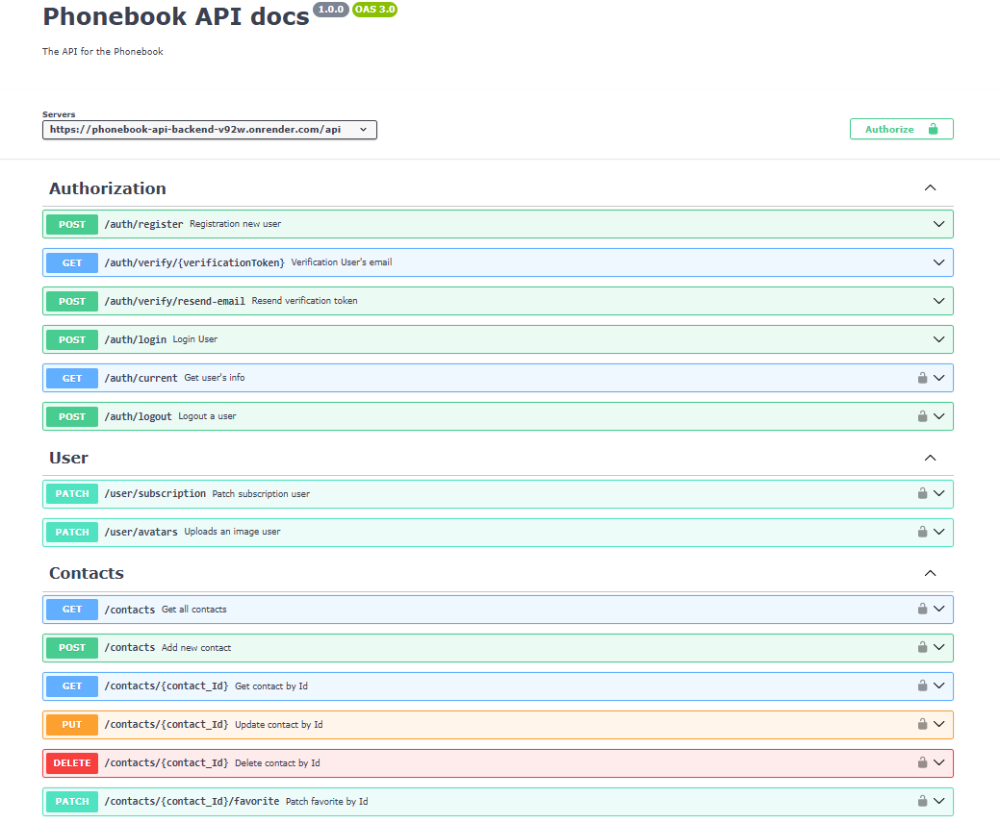

# Phonebook API (backend)

## Стек технологій

## Опис проекту

`Phonebook API - Керуйте своїми контактами:` Можливість зберігати та організовувати свій список контактів, створювати нові контакти, визначати їхні ролі та важливість, також змінювати їх статуси, додавати фотографії user та самим контактним номерам.

`Основні функції:`

- Реєстрація та Авторизація.
- Cтворення нових контактів, включаючи ім'я, номер телефону, додавання до улюблених та фотографій.
- Додавання фотографії user, статусу (Standart, Pro, Vip).
- Верифікація електронної пошти, щоб забезпечити, що адреси користувачів є дійсними.

## Swagger

Специфікація була розроблена за допомогою Swagger Editor. Swagger Editor - це онлайн-редактор для створення, редагування та тестування файлів специфікацій Swagger, які описують REST API.

Розміщення Swagger-документації на бекенді і використання її з допомогою Swagger UI є чудовим способом документувати та візуалізувати API для користувачів та розробників.

## Технічні характеристики

`Зберігання даних:` Дані користувачів та контакти зберігаються в базі даних MongoDB.

`Забезпечення безпеки:` Захист особистих даних користувачів, включаючи шифрування паролів та перевірку доступу до ресурсів.

`Хмарні послуги:` Cloudinary для зберігання фотографій користувачів.

`Посилання на swagger-docs:` https://phonebook-api-backend-v92w.onrender.com/api-docs
